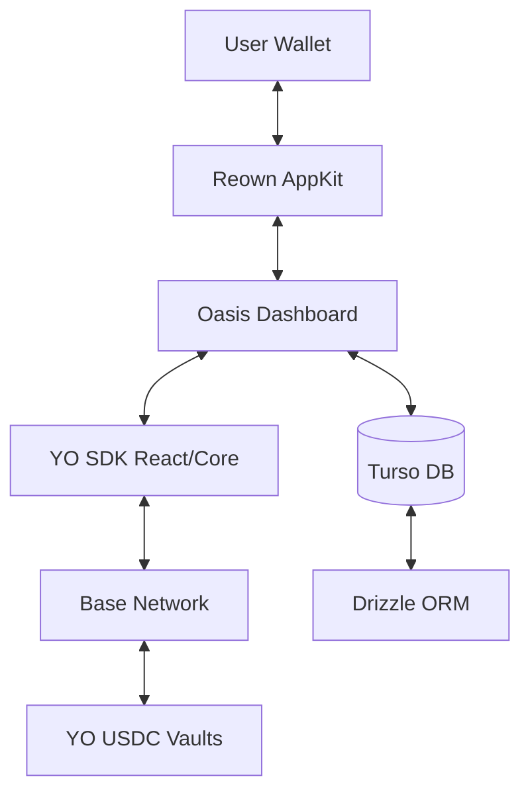

# Oasis — Self-Driving Savings

Oasis is an autonomous wealth cultivation platform that turns idle capital into living infrastructure. Built on the **YO Protocol**, Oasis abstracts the complexity of DeFi into a simple, goal-oriented dashboard where your money works for you, your future, and the causes you care about.

## 🌊 Value Proposition

Traditional finance offers fractions of a percent while extracting your value. DeFi offers massive yields but requires constant monitoring, bridging, and gas fees. Oasis bridges this gap:

- **Money that never sleeps**: Earn ~14% APY on USDC via YO's optimized vault strategies.
- **Autonomous Yield**: Capital is automatically routed across Aave, Compound, and Moonwell for the highest risk-adjusted returns.
- **Goal-Aware Savings**: Split your yield into "Aquifers" — purpose-built pools for emergency funds, vacations, or subscription buffers.
- **Programmable Outflows**: Route your earned yield to verified NGOs or earmark it for monthly bills without ever touching your principal.

---

## 🏗️ Architecture

Oasis is built with a modern, non-custodial stack that prioritizes security and user experience.

### Core Components

- **Frontend**: Next.js 15 (App Router) with Tailwind CSS and Framer Motion for a fluid, high-end UI.
- **Web3 Layer**: Reown AppKit (formerly WalletConnect) for seamless wallet connectivity and SIWE (Sign-In with Ethereum) for secure authentication.
- **Yield Engine**: Powered by the **YO SDK**, interacting with ERC-4626 standard vaults on the **Base** network.
- **Persistence**: Drizzle ORM with Turso (LibSQL) for tracking user configurations, aquifer balances, and transaction history.

### System Diagram



---

## ⚡ YO SDK Integration

Oasis leverages both the `@yo-protocol/react` and `@yo-protocol/core` SDKs to power its yield engine.

### 1. Provider Hierarchy
The application is wrapped in a `YieldProvider` which provides the necessary context for all YO hooks.

```tsx
// src/components/providers/Web3Provider.tsx
import { YieldProvider } from '@yo-protocol/react';

export function Providers({ children }) {
  return (
    <WagmiProvider config={config}>
      <QueryClientProvider client={queryClient}>
        <YieldProvider partnerId={101} defaultSlippageBps={50}>
          {children}
        </YieldProvider>
      </QueryClientProvider>
    </WagmiProvider>
  );
}
```

### 2. Client-Side Interactions
We use the React SDK hooks to manage deposits, redemptions, and position tracking.

```tsx
// src/components/dashboard/DashboardOverview.tsx
import { useUserPosition, useDeposit, useRedeem } from "@yo-protocol/react";
import { VAULTS } from "@yo-protocol/core";

const vaultAddress = VAULTS.yoUSD.address;

// Track user position
const { position } = useUserPosition(vaultAddress);

// Handle deposits
const { deposit, isLoading: isDepositing } = useDeposit({
  vault: vaultAddress,
  onConfirmed: async () => {
    // Record transaction in local DB after on-chain confirmation
    await createUserTransaction({ ... });
  }
});
```

### 3. Server-Side Performance Tracking
For bulletproof accounting, we use the Core SDK to fetch on-chain performance data, calculating unrealized PnL to distinguish between principal and yield.

```tsx
// src/lib/wealth.ts
import { createApiClient, getUserPerformance, VAULTS } from "@yo-protocol/core";

const api = createApiClient();

export async function getWealthSnapshot(walletAddress: string, currentVaultBalance: number) {
  const performance = await getUserPerformance(
    api, 
    'base', 
    VAULTS.yoUSD.address, 
    walletAddress
  );
  
  const earnedYield = Number(performance.unrealized.formatted);
  const protectedPrincipal = Math.max(currentVaultBalance - earnedYield, 0);
  
  return { earnedYield, protectedPrincipal };
}
```

---

## 🚀 Getting Started

### Prerequisites

- Node.js 20+
- A [Reown Cloud](https://cloud.reown.com/) Project ID
- A [Turso](https://turso.tech/) database

### Installation

1. **Clone the repository:**
   ```bash
   git clone https://github.com/your-repo/oasis-yo.git
   cd oasis-yo
   ```

2. **Install dependencies:**
   ```bash
   npm install
   ```

3. **Configure environment variables:**
   Create a `.env.local` file based on `.env.example`:
   ```env
   NEXT_PUBLIC_WALLETCONNECT_PROJECT_ID=your_project_id
   TURSO_CONNECTION_URL=your_turso_url
   TURSO_AUTH_TOKEN=your_turso_token
   ```

4. **Initialize the database:**
   ```bash
   npx drizzle-kit push
   ```

5. **Run the development server:**
   ```bash
   npm run dev
   ```

Open [http://localhost:3000](http://localhost:3000) to enter the Oasis.

---

## 🛠️ Key Features

### Aquifers
Goal-based savings pools that "fill up" as your yield is generated. You can configure what percentage of new yield flows into each aquifer.

### Yield Routers
Automated donation flows. When you execute a donation route, Oasis:
1. Calculates the available unallocated yield.
2. Redeems the exact amount of shares from the YO vault.
3. Transfers the resulting USDC to the NGO's destination address.

### Tax Shield
A specialized routing rule that automatically reserves a percentage of every deposit into a protected tax aquifer, ensuring you're never caught off guard by liabilities.

---

## 📄 License

This project is licensed under the MIT License.

---

Built with ❤️ for the YO Protocol Hackathon.

